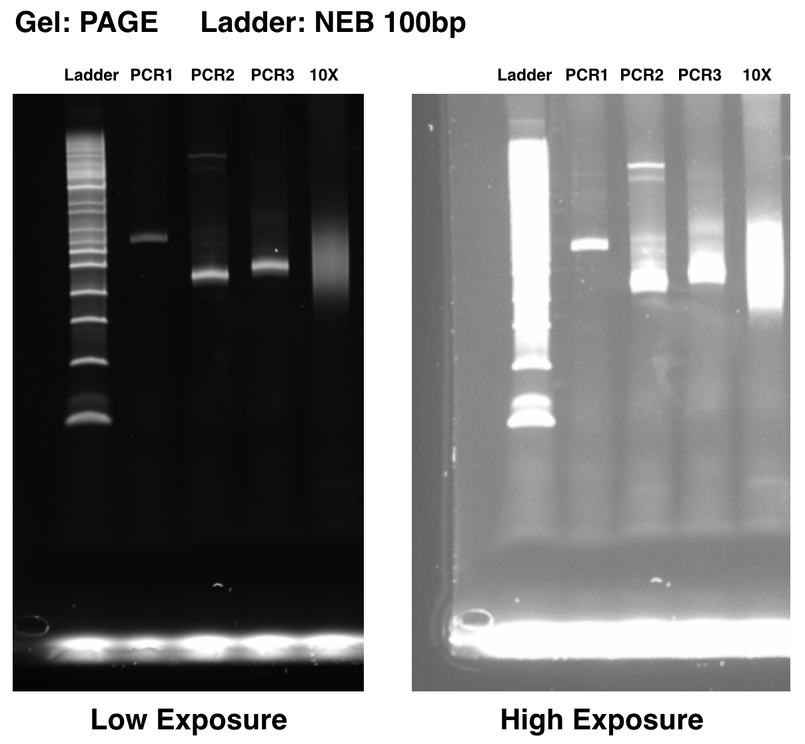
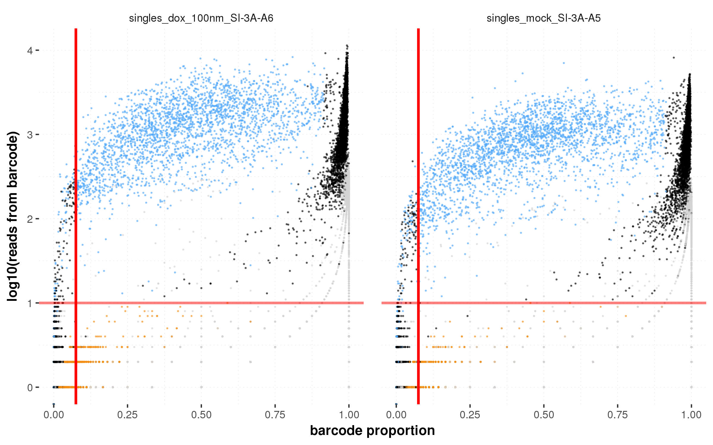

# On the design of CRISPR-based single cell molecular screens
This is a resource for the paper `On the design of CRISPR-based single cell molecular screens`, from the Shendure/Trapnell labs. The paper is available on the [Nature Methods website here](https://www-nature-com.offcampus.lib.washington.edu/articles/nmeth.4604) ([also see free link to PDF](https://t.co/yTKzyV9Pyo)).

We provide info on:
- how to access reagents for CROP-seq for use with CRISPR or CRISPRi
- how to perform enrichment PCR for CROP-seq experiments
- how to use a few pieces of software we have developed to assign guide sequences (or any barcode sequence) to cells in CROP-seq assays or similar
- how to download data from our paper
- the complete set of scripts that we used for the analysis in the paper

## Table of Contents
* [Reagents](#reagents)
* [Enrichment PCR](#enrichment-pcr)
* [Useful Scripts](#useful-script)
   * [Script dependencies](#script-dependencies)
   * [get_barcodes.py](#get_barcodespy)
   * [preprocess_cfg.R](#preprocess_cfgr)
   * [moi_capture_rate_generative_model.py](#moi_capture_rate_generative_modelpy)
* [Data](#data)
   * [GEO](#geo)
   * [Primary Data](#primary-data)
   * [Result Files](#result-files)
   * [Figures and tables](#figures-and-tables)
* [Running Analyses from the Paper](#running-analyses-from-the-paper)
   * [Dependencies](#dependencies)
      * [Python](#python)
      * [R](#r)
      * [Compute Environment](#compute-environment)
      * [Data Downloads](#data-downloads)
   * [Running all analyses](#running-all-analyses)
* [Citation](#citation)

## Reagents
See our paper for a full set of vectors from this study made available on addgene.

Likely of particular interest, we have made a version of the CROP-seq vector that has a grna-backbone that is optimized for CRISPRi (Addgene #106280).

If you use these reagents or software tools provided here, please cite:
```
Andrew J. Hill*, José L. McFaline-Figueroa*, Lea M. Starita, Molly J. Gasperini, Kenneth A. Matreyek, Jonathan Packer, Dana Jackson, Jay Shendure^, and Cole Trapnell^. 2018. “On the Design of CRISPR-Based Single-Cell Molecular Screens.” Nature Methods, February. https://doi.org/10.1038/nmeth.4604.
```

For all CRISPR (not CRISPRi) assays, we simply use the CROPseq-Guide-Puro vector (Addgene #86708) as provided by the Bock lab.

If you use CROP-seq and/or reagents from the Bock lab, please cite:
```
Paul Datlinger, André F Rendeiro*, Christian Schmidl*, Thomas Krausgruber, Peter Traxler, Johanna Klughammer, Linda C Schuster, Amelie Kuchler, Donat Alpar, Christoph Bock (2016). Pooled CRISPR screening with single-cell transcriptome readout. Nature Methods. DOI: 10.1038/nmeth.4177.
```

## Enrichment PCR
We find that using targeted amplification (as done in Dixit and Adamson et al.) increases the rate of assignment in CROP-seq experiment by approximately two-fold. 

Our amplifications were performed on full-length cDNA prior to shearing, but for CROP-seq amplification out post-sheared product may be fine (not tested).

Importantly, our paper describes a protocol for 10X V1, but 10X currently cells their V2 product. We present both protocols below for CROP-seq.

### 10X V1 (what we did in the paper, but V1 no longer sold)
All PCR reactions were performed with a P7 reverse primer (as introduced by the 10X V1 oligo DT RT primer). The PCR was performed with:

```
TTTCCCATGATTCCTTCATATTTGC
```

as the forward primer, priming to part of the U6 promoter. In a second reaction, we then use:

```
TCGTCGGCAGCGTCAGATGTGTATAAGAGACAG-cTTGTGGAAAGGACGAAACAC
```

as the forward primer, priming an inner portion of the U6 promoter adjacent to the guide sequence and adding the standard Nextera R1 primer. Samples were then indexed in a final PCR using standard Nextera P5 index primers of the form:

```
AATGATACGGCGACCACCGAGATCTACAC[8bp Index]TCGTCGGCAGCGTC
```

Each PCR was cleaned with a 1.0X Ampure XP cleanup and one microliter of a 1:5 dilution of the first PCR was carried forward and a 1:25 dilution of the second PCR was carried into the final PCR reaction. PCRs were monitored by qPCR and stopped just prior to reaching saturation to avoid overamplification. The final PCR was run on a Bioanalyzer to confirm expected product size.

### 10X V2 (what you would probably have to do)
The 10X V2 library structure is quite different from V1 ([see here for details](https://assets.contentful.com/an68im79xiti/4fIy9tr6qQuCWamIii0iEa/40658acce7a6756e38537584897840e3/CG000108_AssayConfiguration_SC3v2.pdf)), so the primers have to be changed.

The reverse primer is no longer a P7 primer for V2, it is a partial R1 primer in the first reaction:
```
CTACACGACGCTCTTCCGATCT
```

and the remainder of R1 and P5 (separated by hyphen) must be added in the second PCR (although could also do this at any point):
```
AATGATACGGCGACCACCGA-GATCTACACTCTTTCCCTACACGACGCTC
```

The forward primers are similar but also slightly different as R2 must be used instead of R1 on this end due to the flipped construction of V2 libraries.

The first PCR is done with:
```
TTTCCCATGATTCCTTCATATTTGC
```

as the forward primer, priming to part of the U6 promoter as above. In a second reaction, we then use:

```
GTCTCGTGGGCTCGGAGATGTGTATAAGAGACAG-cTTGTGGAAAGGACGAAACAC
```

as the forward primer, priming on the U6 promoter adjacent to the guide sequence and adding the standard Nextera R2 primer. Samples can then be indexed in a final PCR using standard Nextera P7 index primers of the form:

```
CAAGCAGAAGACGGCATACGAGAT[8bp Index]GTCTCGTGGGCTCGG
```

Other details should be similar to V1 protocol.

Here is an example of the products from each of the above 10X V2 enrichment PCR reactions run on a PAGE gel next to a unbiased 10X library as a reference (note there are two roughly 500bp bands for this ladder on PAGE gels):


While there may be some other bands visible depending on exposure, we typically observe that approximately 99.9% of reads don't map to the reference used by cellranger (endogenous), and the majority of remaining fragments have what appear to be correct sequences with most remaining reads largely appearing to have errors due to things like sequencing errors, synthesis errors, PCR errors, etc. We have also seen a couple cells that have empty vectors with no guide (extremely infrequent). 

### Other protocols
In principle, this protocol could be adapted to a number of different scRNA-seq methods. If it is not obvious how one might do this in your case, please let us know.

## Useful Scripts
There are a couple scripts from this repository that we use for this type of experiment. Documentation for each script can be viewed with `--help`, but the important features are documented here. all but the last of these tools is fairly dependent on the output of the 10X genomics `cellranger` pipeline, so compatibility with other platforms will require tweaks.

Note that these scripts do not depend on any of the other files in this repository.

### Script dependencies
There are some dependencies for each of these scripts.

We have run the python code under python 2.7.3+ and 3 (3.5+ is what we use), they should both be compatible. We have run the R code under R 3.3.0 but earlier versions may be compatible.

For python tools we report versions of the tools that we have used, but other versions may be compatible. For R tools we report required packages. Versions we have used are in sessionInfo in the larger [R dependencies](#r) section; although other versions will be fine in many cases. We note the required packages for just these tools here.

The first tool, `get_barcodes.py`, requires:
- `pysam` (pysam==0.10.0)
- (optional) `progressbar2` (progressbar2==3.34.3)
- (optional) `scikit-bio` (scikit-bio==0.5.1): only compatible with python3, see advantages in documentation below.

The second tool, `preprocess_cfg.R`, requires:
- dplyr
- Matrix
- monocle
- stringr
- argparse
- ggplot2
- gridExtra
- scales
- viridis

The final tool, `moi_capture_rate_generative_model.py`, requires:
- scipy (scipy==0.19.0)
- numpy (numpy==1.13.3)

### get\_barcodes.py
We generally do PCR enrichment of the guide carrying Pol II transcripts and index them separately from the main unbiased 10X sequencing libraries. We then run these enrichment libraries as samples through cellranger (with the DNA sequence of the index specified instead of a `SI-*` ID) and then use the position sorted BAM files provided in the cellranger outputs as a starting point for obtaining the guide sequences observed in each cell.

We find this useful because cellranger corrects the cell barcode and UMI entries and puts them in tags within the BAM file. cellranger can also be run with secondary analysis turned off in its most recent versions via the `--no-secondary` option to cut down on time.

In order to run the script you will need a whitelist of guides (or barcodes) that were used in your library. For example, I might make a file `whitelist.txt` that contains the following:
```
GGATCTGTATCAAGCCGTTC
GATTTATTAGAGCGTCTTAA
AAAATGTCCCTCCGTTCTTA
GAAGTACTTAAACAACTACA
```

You then need to specify the sequence that will appear directly in front of the guide sequence/barcode in the 10X cDNA read. For example, in our CROP-seq experiments we happen to use: `GTGGAAAGGACGAAACACCG`

You may then run the script like so:
```
python get_barcodes.py --input_bams my_barcode_enrichment_cellranger_dir/outs/possorted_genome_bam.bam -o ko_barcodes.txt --whitelist whitelist.txt --search_seq GTGGAAAGGACGAAACACCG
```

The BAM file used as input may also be a space-separated list of BAM files if needed.

This will output a file that looks like this (TSV format):
```
cell               barcode                 read_count   umi_count
ATGACGTGCGACAT-1   GTCCGACCCTGGATGCCAAT    1037         27
```

Where each row is an observed barcode in a given cell and the associated read and UMI counts. There may also be a number of low count entries, and this is pretty typical and they are readily filtered in downstream analysis. Counts of zero in this file are the result of chimera removal described below.

Note that by default, we use an unsupervised method for detecting chimeras from PCR via UMIs as described in [Dixit et al.](http://www.cell.com/cell/references/S0092-8674(16)31610-5). This is a very simple method where, within each cell, we tabulate the number of times we observe each UMI and then tabulate the number of times we observe each UMI supporting each potential genotype. For each UMI/genotype combination if the ratio of the number of UMI observations in support of that genotype to all instances of that UMI in the cell less than 0.20, the reads are deemed to be chimeras (spurious molecules where the UMIs now appear on a different molecule than the original) and removed. This tends to clean out some of the spurious barcodes that we observe in cells. You may set to 0 to turn off or raise to be more stringent with the `--chimeric_threshold` argument.

We attempt to correct barcodes within a reasonable edit distance (which you may also set explicitly with `--force_correction <int>`). If a barcode is observed that was not correctable to your whitelist it will be prefixed with `unprocessed_`. This may result from sequences missing from your whitelist or reads with high rates of sequencing error, for example.

Note that if you are running this script without `scikit-bio` installed (only available for python3), you will have to use the `--no_swalign` option. If you do have skbio, running with the default will allow the program to search for imperfect matches for the `--search-seq` thus rescuing as many reads as possible.

Finally, a progress bar will be displayed when running this script if you have the `progressbar2` package installed.

### preprocess\_cfg.R
After running `get_barcodes.py`, we usually take the barcode assignments above and pair them with the scRNA-seq data, outputting the files as a CellDataSet object in RDS format for use with [monocle](http://cole-trapnell-lab.github.io/monocle-release/).

To do this you just have to make a metadata sheet (TSV format) for all the samples you want to combine, I'll call it `sample_metadata.txt`:
```
sample_directory              ko_barcode_file   condition    treatment
my_scrnaseq_cellranger_dir    ko_barcodes.txt   mycondition  mock
```

Only the first two columns are required, `sample_directory` or the top-level directory of your 10X scRNA-seq run (not the barcode enrichment one, this is your actual sample), and `ko_barcode_file`, which is the output file of the `get_barcodes.py` script. All other columns are optional and you can have any names you want. These fields will be propagated to metadata in output files if you choose to add them. Multiple samples can be included by including multiple rows.

You also have to provide the following TSV file, I'll call it `gene_barcode_associations.txt`:
```
APC            GAAGTACTTAAACAACTACA
APC            TGATCTTGACAAAGAAGAAA
APC            AGAGTGCAGTCCTGTTCCTA
ARID1A         GCGGTACCCGATGACCATGC
ARID1A         ATGGTCATCGGGTACCGCTG
ARID1A         CCCCTCAATGACCTCCAGTA
```

Where the first column (no headers) is a gene name (or whatever is relevant to your application) and the second column is the guide (or barcode) sequence. This second field should match the whitelist you provided to `get_barcodes.py`.

Finally, you may then run the following:
```
Rscript preprocess_cfg.R sample_metadata.txt output_cds.rds output_metadata.txt --guide_metadata gene_barcode_associations.txt --barcode_enrichment_qc_plot qc_plot.png
```

Note that the `barcode_enrichment_qc_plot` (described below) is optional but we think it is useful to examine for each experiment.

There are a few other options that you may want to change depending on your needs:
- `--genome`: hg19 by default, but this must match the name of the genome used in your cellranger run
- `--ko_assignment_reads_threshold`: 10 by default; the number of reads (or umis if --umis set) required for a barcode to be considered
- `--ko_assignment_proportion_threshold`: 0.075 by default; the fraction of all reads (or umis if --umis set) from barcoded transcripts in each cell that a given barcode must exceed to be considered a real barcode
- `--aggregated`: if you happen to use `cellranger aggregate` and you are pointing to aggregated output, you must set this flag
- `--umis`: use UMI counts for thresholds and qc plot instead of read counts
- `--genotype_indicator_columns`: this will add column for every individual target (combined across guides/barcodes) that has TRUE for cells that have this genotype present.
- `--size_factor_filter`: we sometimes find it useful to remove clusters of cells with low average size factors and this turns that feature on (takes much longer because it will perform dimensionality reduction and clustering)
- `--log2_size_factor_threshold` (default -0.85): when using `--size_factor_filter`, this is the threshold imposed in the log2(average size factor) for clusters.

Different `ko_assignment_*` thresholds can be chosen to be more or less strict about which barcodes should be included. For the time being, we typically just choose thresholds that seem reasonable; there is no automated strategy that we have developed thus far.

We have also explored using UMIs rather than reads for the latter two arguments and find that in some cases it improves results. If you want to use UMIs, you may specify the `--umis` option and the above thresholds will be with respect to UMI counts rather than read counts. The QC plot in this case would also use UMIs when using this option.

The main output files from this script are (as named in toy example above):
- `output_cds.R`: the monocle CellDataSet object in RDS format. Can be read into R with `readRDS` function. pData table of this CDS object is equivalent to the metadata table below.
- `output_metadata.txt`: a TSV formatted metadata table of cells and their assigned barcodes and metadata fields. Note that the `gene` column will contain the assigned gene (or genes) based on your `gene_barcode_association.txt` file. There are also a set of indicator columns with TRUE when a barcode to a given gene is observed in a given cell, `guide_count` column or the number of guides observed in the cell (passing above thresholds), columns that specify the guide/barcode sequences observed, etc. Most of them should be fairly self explanatory.
- `qc_plot.png` (optional) this is a plot that we typically make to perform a quick check of our barcode enrichment libraries and the thresholds we have chosen. An example is provided below (see the supplement of our paper for details and more examples).

Example QC plot:


In a typical experiment, where one would have used a low MOI lentiviral transduction, one would expect that most of the points representing legitimate assignments in this plot (cell/observed barcode pairs) to fall towards the upper right -- they have a good number of reads and make up the vast majority of the barcodes observed in that cell.

There will be some portion of cells (in blue here) that have multiple barcodes assigned to them, which could be the result of doublets from scRNA-seq, or cells that were infected with more than one unique guide. In most of the analyses in our paper, we only use cells with a single assignment, but cells with multiple guides are included in the outputs of this script.

This plot also shows cells that are in the filtered set from 10X (so have high enough UMI counts to be considered a cell) but that do not have an assignment in orange. Cells that do not fall in the filtered set from 10X appear grey in these plots.

The thresholds set at the command line are reflected by the red lines spanning the plot horizontally and vertically. We often use this plot as a guide for setting reasonable thresholds to exclude points at the periphery that appear to be noise.

### moi\_capture\_rate\_generative\_model.py
We also sometimes find it useful to use the approach outlined in [Dixit et al.](http://www.cell.com/cell/abstract/S0092-8674(16)31610-5) to estimate the most likely multiplicity of infection (MOI) and capture rate (rate at which you can ID the barcoded transcripts in cells given incomplete detection) from guide/barcode assignments. While we have had some success with this method, we have observed that it can also produce results that don't make sense under certain conditions, particularly when one has drawn inappropriate thresholds when using `preprocess_cfg.R`.

Note that this script is based heavily on code provided by Atray Dixit [here](https://github.com/asncd/MIMOSCA/blob/master/GBC_CBC_pairing/fit_moi.ipynb) and this is simply a convenient implementation of the ideas from [Dixit et al.](http://www.cell.com/cell/abstract/S0092-8674(16)31610-5).

The script is fairly simple, all you have to do is provide it with the metadata table output by `preprocess_cfg.R` (`output_metadata.txt` in the toy example above):
```
python moi_capture_rate_generative_model.py output_metadata.txt moi_capture_rate_likelihoods.txt
```

This script could also be used indepently of `preprocess_cfg.R` -- all you need is an input file with a column called `guide_count` which is the number of guides observed in each cell (must include zeros for cells with no guide observed!) and optionally another column that specifies the sample for each of the rows if you are running with multiple samples combined.

Note that there are a few other options that are worth considering:
- `--sample_column`: if you have combined samples into one dataset, you'll want to specify the name of a column in the input table that distinguishes them from one another.
- `--capture_probability_min`: 0 by default; the minimum capture rate of barcoded transcripts to consider
- `--capture_probability_max`: 1 by default; the maximum capture rate of barcoded transcripts to consider
- `--capture_probability_step`: 0.01 by default; step size when sweeping the capture rate parameter in estimates
- `--moi_min`: 0.05 by default; the minimum MOI to consider.
- `--moi_max`: 10 by default; the maximum MOI to consider (should somewhat higher than you think is likely, default typically works fine).
- `--moi_step`: 0.1 by default; step size when sweeping MOI parameter in estimates

It will then output a file that looks something like this:
```
sample    capture_probability    moi       log_likelihood
NA        0.0                    0.05      -inf
NA        0.01                   0.05      -37796.863947
NA        0.02                   0.05      -32835.568872
NA        0.03                   0.05      -29935.8322619
```

If you have specified a sample column with `--sample`, the `sample` column above will indicate which sample the estimates apply to rather than having NA's.

To interpret results, you would look at some of the rows with *highest* log likelihood values. We recommend looking at a few of the best sets of parameters to see what the range of possible parameters could be. Again, we advise caution in using these estimates when the guide count distribution given your chosen thresholds deviates substantially from a poisson shifted left by incomplete capture (the model assumed by this method) or when the results seem otherwise implausible.

## Data
Should you want to access our data or run the analyses presented in the paper directly, you may download the data in several ways.

### GEO
We have deposited BAM files, the CellDataSet RDS files described below, as well as matrix-market formatted matrices with metadata on GEO along with documentation of the files if you prefer to download from there for your own purposes: `GSE108699`

### Primary Data
We don't expect that many people will download the primary data, as it includes all BAM files and other data types that are very large. Most of the useful outputs for analyzing the data can be obtained as described in the `Result Files` section below.

This folder contains things like:
- Outputs from `cellranger` pipeline (including BAM files)
- Tables of guides we used in our study and their gene associations (also included in `data.tiny` folder in repo)
- Data downloaded from Adamson et al. study as mentioned in our paper
- Sample metadata sheets for each of the experiments in our study (also included in `data.tiny` folder in repo)
- Sequencing data from our FACS swap rate experiments
- GMT files used in gene set enrichment analyses (also included in `data.tiny` folder in repo)

This download is quite large at 166GB.

As mentioned above, we have also included a subset of these files separate from the full download in the `data.tiny` folder of this repo in case it is useful.

You would download via:
```
wget http://krishna.gs.washington.edu/content/members/ajh24/single_cell_ko_data_release/data.tar.gz
tar -xzvf data.tar.gz
```

### Result Files
We expect that most people would be more interested in downloading just the processed results.

This folder contains results of the analyses; things like:
- Monocle CDS objects containing expression matrices and metadata in RDS format for each scRNA-seq dataset
- pdata (or cell metadata) tables for all experiments (includes KO assignments, etc.)
- Results from DEG testing on screen data and on swap rate simulations of data
- Capture rate / MOI parameter sweeps with log likelihoods
- Intermediate data files for our tests for enrichment of genotypes in TSNE clusters

This is a much smaller download at 2.8GB and is probably of greater utility to the vast majority of people than the Primary Data.

You would download via:
```
wget http://krishna.gs.washington.edu/content/members/ajh24/single_cell_ko_data_release/temp_data.tar.gz
tar -xzvf temp_data.tar.gz
```

The following files may be of particular interest. All RDS files are CellDataSet objects compatible with monocle that contain all expression data and associated cell and gene metadata. These can be read into R using the `readRDS` function. With some basic familiarity with bioconductor/monocle one could also save these to matrix-market formatted files if desired.

- `aggregated_cds.rds`: CDS from our CROP-seq screen of tumor suppressors
- `aggregated_cds_pdata.txt`: metadata table for the above CDS as in TSV format
- `aggregated_cds.no_enrichment.rds`: Same as `aggregated_cds.rds` but if the assignments were instead made without PCR enrichment libraries.
- `cropseq.sample_metadata.no_enrichment.txt`: metadata table for the above CDS as in TSV format
- `aggregated_cds.initial_screens.rds`: CDS from our initial pooled and arrayed screens aggregated using `cellranger aggregate`
- `aggregated_cds_pdata.initial_screens.txt`: metadata table for the above CDS as in TSV format

### Figures and tables
Figure panels and tables that went into the paper are already included in the repository:
- `figures`
- `supplemental_figures`
- `tables`
- `reviewer_figures`

## Running Analyses from the Paper
We have also included all the scripts we used to perform the analyses in the paper in case it is useful.

This software is not supported; it is mostly intended to document how we did the analyses and put the scripts out in the open in case the ideas or implementations are useful to anyone.

### Dependencies
The code is written in python and R, so both languages will need to be available. We have run this code under python 2.7.3+ and 3 (3.5+ is what we use), they should both be compatible. `R 3.3.1` is the oldest version we have tested on.

#### Python
The following python packages are required (our package versions are noted but code may be compatible with other versions):
- scipy (scipy==0.19.0)
- pysam (pysam==0.10.0)
- numpy (numpy==1.13.3)
- (optional) progressbar2 (progressbar2==3.34.3)
- (optional) scikit-bio (scikit-bio==0.5.1): only compatible with python3, can optionally be used when extracting gRNA sequences from reads
- (optional) easygrid: this is a simple job management tool I made around the time of this project and is required for running `runall.py`, but not for anything else. [Github](https://github.com/andrewhill157/easygrid). Note only works with SGE currently.

#### R
This is a list of packages loaded in the all the scripts provided:
- argparse
- colorRamps
- dplyr
- ggplot2
- ggrepel
- glmnet
- grid
- gridExtra
- Matrix
- matrixStats
- monocle
- parallel
- piano
- plyr
- RColorBrewer
- reshape2
- scales
- stringr
- tidyr
- viridis

Here is my sessonInfo after loading the packages above:
```
> sessionInfo()
R version 3.3.0 (2016-05-03)
Platform: x86_64-pc-linux-gnu (64-bit)
Running under: CentOS release 6.9 (Final)

locale:
 [1] LC_CTYPE=en_US.UTF-8       LC_NUMERIC=C
 [3] LC_TIME=en_US.UTF-8        LC_COLLATE=en_US.UTF-8
 [5] LC_MONETARY=en_US.UTF-8    LC_MESSAGES=en_US.UTF-8
 [7] LC_PAPER=en_US.UTF-8       LC_NAME=C
 [9] LC_ADDRESS=C               LC_TELEPHONE=C
[11] LC_MEASUREMENT=en_US.UTF-8 LC_IDENTIFICATION=C

attached base packages:
 [1] splines   stats4    parallel  grid      stats     graphics  grDevices
 [8] utils     datasets  methods   base

other attached packages:
 [1] viridis_0.4.0       viridisLite_0.2.0   tidyr_0.6.3
 [4] stringr_1.2.0       scales_0.5.0        reshape2_1.4.2
 [7] RColorBrewer_1.1-2  plyr_1.8.4          piano_1.12.1
[10] pheatmap_1.0.8      monocle_2.5.7       DDRTree_0.1.5
[13] irlba_2.2.1         VGAM_1.0-4          Biobase_2.32.0
[16] BiocGenerics_0.18.0 matrixStats_0.51.0  gridExtra_2.2.1
[19] glmnet_2.0-5        foreach_1.4.3       Matrix_1.2-6
[22] ggrepel_0.6.5       ggplot2_2.2.1       dplyr_0.7.3
[25] colorRamps_2.3      argparse_1.0.1      proto_0.3-10

loaded via a namespace (and not attached):
 [1] Rcpp_0.12.12           lattice_0.20-33        relations_0.6-6
 [4] gtools_3.5.0           assertthat_0.2.0       slam_0.1-34
 [7] R6_2.2.2               qlcMatrix_0.9.5        gplots_3.0.1
[10] rlang_0.1.2            lazyeval_0.2.0         gdata_2.18.0
[13] combinat_0.0-8         sets_1.0-16            Rtsne_0.13
[16] igraph_1.1.2           munsell_0.4.3          pkgconfig_2.0.1
[19] marray_1.50.0          findpython_1.0.1       tibble_1.3.4
[22] RANN_2.5               codetools_0.2-14       bitops_1.0-6
[25] densityClust_0.3       gtable_0.2.0           magrittr_1.5
[28] KernSmooth_2.23-15     stringi_1.1.5          bindrcpp_0.2
[31] getopt_1.20.0          limma_3.28.21          fastICA_1.2-1
[34] rjson_0.2.15           iterators_1.0.8        tools_3.3.0
[37] glue_1.1.1             HSMMSingleCell_0.106.2 colorspace_1.2-7
[40] cluster_2.0.4          caTools_1.17.1         bindr_0.1
```

While results should be similar for current versions of the following R packages, these are the exact commit hashes we used for the aanalysis in the paper, just for the record:
- Monocle: commit `36cc7559db97108f5551534bef259832643d6e58`
- DensityClust: commit `edfae798225b23cdeedc41367591e37648797943`
- DDRTree: commit `843607a5822276010cf4d47597213e607f7477a2`

#### Compute Environment
We use SGE at UW Genome Sciences and the main driver script here, `runall.py`, uses a package I made called `easygrid` that manages job execution. It only supports SGE currently.

None of the individual scripts require `easygrid` or SGE but some of the analyses, particularly DEG testing in our CROP-seq data and in data where swap rates must be simulated and tested for DEGs many times, will become much less feasible to run if you are not using a cluster to parallelize them.

#### Data Downloads
You will have to have downloaded the [Primary Data](#primary-data) if trying to run everything or just the [Result Files](#result-files) if you just want to try out some of the downstream analyses.

These must go in the main directory of the repo and must be called `data` and `temp_data` respectively to be compatible with the analysis scripts.

### Running all analyses
If you have installed `easygrid` as mentioned above and want to run all analyses, you may use `python runall.py` to do so. Note that you must have SGE and again this is not supported if there happen to be technical issues that are non-trivial.

If you do not have SGE or easygrid, then you may use this script as a way of seeing how the analyses were performed and what commands are being issued.

We hope that even if you don't run all the analyses that you still find some of the scripts in this repository useful in thinking about your own analyses or in understanding how we arrived at results in the paper.

Many of the scripts (although not scripts that simply generate figures, etc.) have `--help` enabled to document arguments.

## Citation
As mentioned above, if you use reagents from our paper, such as the CROP-seq vector optimized for use with CRISPRi, or software tools provided here, please cite:
```
Andrew J. Hill*, José L. McFaline-Figueroa*, Lea M. Starita, Molly J. Gasperini, Kenneth A. Matreyek, Jonathan Packer, Dana Jackson, Jay Shendure^, and Cole Trapnell^. 2018. “On the Design of CRISPR-Based Single-Cell Molecular Screens.” Nature Methods, February. https://doi.org/10.1038/nmeth.4604.
```

If you use CROP-seq and/or reagents from the Bock lab, please cite:
```
Paul Datlinger, André F Rendeiro*, Christian Schmidl*, Thomas Krausgruber, Peter Traxler, Johanna Klughammer, Linda C Schuster, Amelie Kuchler, Donat Alpar, Christoph Bock (2016). Pooled CRISPR screening with single-cell transcriptome readout. Nature Methods. DOI: 10.1038/nmeth.4177.
```
